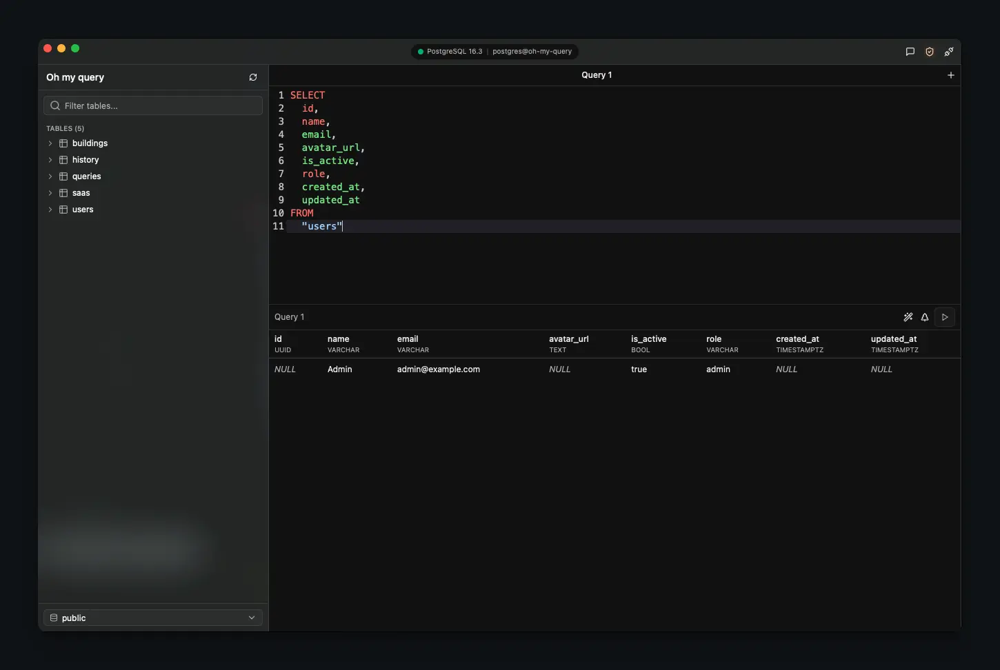

<div align="center">



# oh-my-query

A modern database client for querying with AI.

[](LICENSE)
[](https://github.com)
[](https://v2.tauri.app)
[](https://react.dev)
[](https://rust-lang.org)

</div>

<br />

oh-my-query is a native desktop database client with a built-in AI assistant. Connect to your databases, explore schemas, write queries with intelligent autocomplete, and let AI help you along the way — all wrapped in a macOS-native interface with vibrancy effects and a glassmorphism design.

<br />

## Features

### Multi-database support

Connect to **PostgreSQL**, **MySQL**, **SQLite**, **MongoDB**, and **Redis** from a single app. Browse schemas, inspect tables and columns, and switch between databases on the fly.

### AI assistant

Chat with an AI that understands your schema. It sees your tables, columns, types, and relationships — then generates SQL you can insert directly into the editor. Supports **OpenAI**, **Anthropic**, **OpenRouter**, and **local models** (Ollama).

### Smart editor

CodeMirror-powered SQL editor with schema-aware autocomplete, syntax highlighting, and a syntax tree inspector. Work across multiple query tabs with full keyboard shortcut support.

### SQL dialect engine

Write SQL in any dialect and run it against any database. Powered by [polyglot-sql](https://github.com/polyglot-sql/polyglot-sql), queries are automatically transpiled between dialects at execution time. The built-in SQL formatter is also dialect-aware, supporting 30+ SQL dialects including PostgreSQL, MySQL, BigQuery, Snowflake, DuckDB, ClickHouse, Spark, and more.

### Native experience

Built with Tauri v2 for a true macOS-native feel. Vibrancy effects, a Dynamic Island-style connection indicator in the titlebar, dark mode by default, and smooth spring animations throughout.

<br />

## Keyboard Shortcuts

| Shortcut          | Action            |
| ----------------- | ----------------- |
| `Cmd + Enter`     | Execute query     |
| `Cmd + T`         | New query tab     |
| `Cmd + W`         | Close current tab |
| `Cmd + 1-9`       | Switch to tab     |
| `Cmd + B`         | Toggle sidebar    |
| `Cmd + Shift + F` | Beautify SQL      |
| `Cmd + Shift + C` | Toggle AI chat    |

<br />

## Installation

### Homebrew (recommended)

```bash
brew install --cask victor-teles/tap/oh-my-query
```

### Manual download

Download the latest `.dmg` from the [GitHub Releases](https://github.com/victor-teles/oh-my-query/releases) page. Open the DMG and drag **Oh my query** to your Applications folder.

> Available for macOS (Apple Silicon and Intel).

<br />

## Development

### Prerequisites

- [Bun](https://bun.sh) v1.3.9+
- [Rust](https://rustup.rs) (for the desktop app)

### Getting started

```bash
# Install dependencies
bun install

# Start the web app
bun run dev:web

# Start the desktop app
cd apps/web && bun run desktop:dev
```

The web app runs at [localhost:3001](http://localhost:3001).

<br />

## Project Structure

```
oh-my-query/
├── apps/
│   └── web/                 # React frontend + Tauri desktop shell
│       ├── src/
│       │   ├── routes/      # File-based routing (TanStack Router)
│       │   ├── components/  # UI components
│       │   ├── hooks/       # Custom React hooks
│       │   ├── contexts/    # React contexts
│       │   └── lib/         # Utilities, Tauri bridge, AI providers
│       └── src-tauri/       # Rust backend (database drivers, commands)
├── packages/
│   ├── config/              # Shared TypeScript config
│   └── env/                 # Type-safe environment variables
├── turbo.json
└── package.json
```

<br />

## Tech Stack

**Frontend** — React 19, TanStack Router, Tailwind CSS v4, shadcn/ui, CodeMirror, Framer Motion, Vercel AI SDK

**Desktop** — Tauri v2, Rust, sqlx (PostgreSQL/MySQL/SQLite), mongodb, redis, polyglot-sql (transpilation & formatting)

**Tooling** — Turborepo, Bun, TypeScript 5, Ultracite (Oxlint + Oxfmt)

<br />

## Contributing

Contributions are welcome. Here's how to get started:

1. Fork the repository
2. Create a feature branch (`git checkout -b my-feature`)
3. Make your changes
4. Run `bun run fix` to lint and format
5. Commit and open a pull request

<br />

## License

[MIT](LICENSE)
